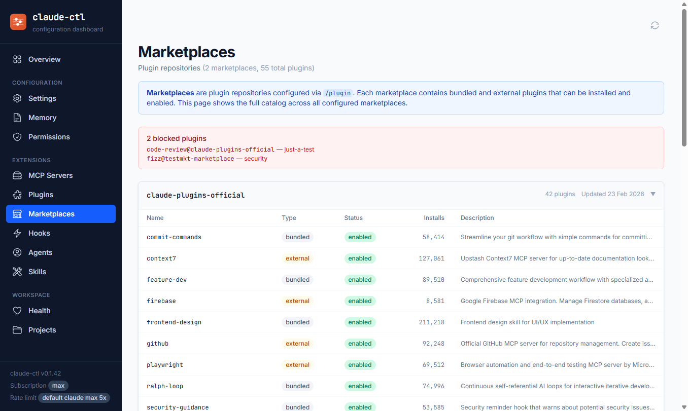
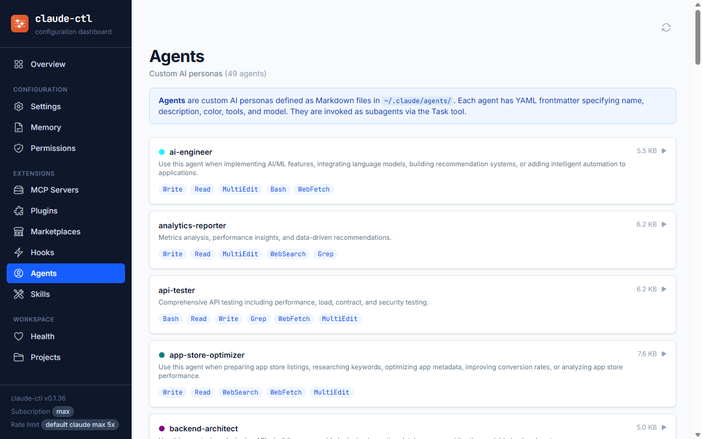

<p align="center">
  
</p>

<h1 align="center">claude-control</h1>

<p align="center">
  <a href="https://github.com/code-by-gunnar/claude-control/actions/workflows/ci.yml"></a>
  <a href="https://www.npmjs.com/package/claude-control"></a>
</p>

<p align="center">
  CLI + web dashboard for discovering, understanding, and managing Claude Code configuration across all scope levels.
</p>


## Why

Claude Code is far more capable than most users realise. Beyond the basics, it supports
custom agents, skills, hooks, MCP servers, plugin marketplaces, memory files with import
chains, granular permission rules, and a four-level configuration hierarchy that merges
settings from managed, user, project, and local scopes.

Most of this is invisible by default.

Configuration lives across dozens of files scattered through `~/.claude/`, `.claude/`,
`.claude.local/`, and system-wide managed paths. There's no built-in overview. No way to
see what's active, what's overriding what, or what you're not using yet. Discovering that
agents even exist means reading the docs. Figuring out which of your MCP servers is actually
loading means opening three different JSON files and resolving the merge rules in your head.

This creates two problems at once: a **visibility problem** for power users who know what
they have but can't see the full resolved state, and a **discovery problem** for everyone
else who doesn't know what Claude Code is capable of in the first place.

`claude-ctl` solves both. It scans your entire Claude Code configuration across every scope
level, resolves the full override hierarchy, and presents everything in one place — a CLI
and web dashboard that shows you exactly what Claude Code sees, what's configured, what's
available, and what's missing. The health score tells you how complete your setup is. The
individual pages let you explore each feature area in detail.

It's the control centre that makes Claude Code's full capability visible and understandable.

## Why Not Just Open the Files?

You can — but there's a catch: Claude Code's configuration isn't what's in any single file.
It's the *result of merging* up to four layers together, where higher scopes silently override
lower ones. A `deny` rule in your user settings will suppress an `allow` rule in your project
settings, and you'd never know by looking at either file alone.

`claude-ctl` resolves the full override chain and shows you the **effective** state — what
Claude Code actually sees at runtime. It also surfaces things that are easy to miss when
browsing files: which CLAUDE.md files are being imported by other CLAUDE.md files, which MCP
server env vars are set vs. missing, which permissions are being overridden at which scope,
and whether your overall setup matches recommended best practices.

If your config is simple, opening files works fine. If you're running multiple MCP servers,
custom agents, marketplace plugins, and project-level overrides, `claude-ctl` saves you from
holding the whole picture in your head.

## How It Fits In

The Claude Code ecosystem has grown quickly. Here's how `claude-control` relates to other
tools you might encounter:

| Tool | What it does |
|------|-------------|
| **claude-control** *(this)* | Discovery + visibility layer. Shows the full Claude Code config landscape — what's configured, what's available, and what's missing. |
| `claude-code-templates` | Installs pre-built agents, commands, hooks, and MCP configs into your setup |
| `claude-flow` | Orchestrates multi-agent workflows and swarms |
| `FleetCode` | Runs multiple Claude Code sessions in parallel with git worktree isolation |
| `ductor` | Controls Claude Code remotely via Telegram with cron and webhook support |

**`claude-control` is intentionally read-only.** It doesn't install plugins, modify settings,
or change Claude Code's behaviour in any way. Think of it as `git status` for your Claude
Code configuration — a safe way to understand what's there before you make changes.

If you want to *change* your configuration, you'll do that by editing files directly or using
the tools above. `claude-control` helps you understand what you have and whether it's set up correctly.

## What It Does

`claude-control` scans Claude Code configuration files across all four scope levels (managed, user, project, local), resolves settings with full override chains, and displays the effective merged state of your setup. It shows MCP servers with automatic secret masking, extracts hooks and permissions, discovers CLAUDE.md memory files with import chains, provides configuration health scoring, and supports cross-project comparison. Everything is available as a terminal CLI or an interactive web dashboard.

## Install

```bash
npm install -g claude-control
```

Then use `claude-ctl` anywhere:

```bash
claude-ctl scan          # Discover all config files
claude-ctl status        # Summary of configured vs missing
claude-ctl dashboard     # Launch web dashboard
```

Or run without installing via `npx claude-control <command>`.

## CLI Commands

| Command | Description |
|---------|-------------|
| `claude-ctl scan` | Discover all config file locations and their existence status |
| `claude-ctl status` | Summary of configured vs missing files across scopes |
| `claude-ctl settings` | View resolved settings with scope and origin tracking |
| `claude-ctl memory` | List CLAUDE.md files and preview their content |
| `claude-ctl mcp` | List MCP servers across all scopes with secret masking |
| `claude-ctl hooks` | View configured hooks and the event catalog |
| `claude-ctl commands` | List custom slash commands and skills |
| `claude-ctl permissions` | Merged permissions audit with deny/ask/allow resolution |
| `claude-ctl agents` | List custom agent definitions from ~/.claude/agents/ |
| `claude-ctl plugins` | List installed plugins with status and MCP servers |
| `claude-ctl marketplaces` | Browse plugin marketplace catalogs |
| `claude-ctl account` | Show subscription type and rate limit tier |
| `claude-ctl health` | Configuration health score with category breakdown |
| `claude-ctl compare` | Cross-project configuration comparison |
| `claude-ctl dashboard` | Launch the interactive web dashboard |

## Common Flags

All commands support these flags:

- `--json` — Output results as machine-readable JSON instead of formatted tables
- `--help` — Show help for any command

Examples:

```bash
# JSON output for scripting
claude-ctl settings --json

# Pipe to jq for filtering
claude-ctl mcp --json | jq '.servers[] | select(.scope == "project")'

# Help for a specific command
claude-ctl health --help
```

## Web Dashboard

The web dashboard provides a visual interface for exploring your Claude Code configuration. Launch it with:

```bash
claude-ctl dashboard
```

This starts a local server and opens your browser at `http://localhost:3737`. Use `--port` to change the port:

```bash
claude-ctl dashboard --port 8080
```

### Dashboard Pages

The dashboard includes 12 pages covering every area of Claude Code configuration. Click any screenshot to expand.

<details>
<summary><strong>Overview</strong> — At-a-glance summary of your entire Claude Code configuration</summary>
<br>


</details>

<details>
<summary><strong>Settings</strong> — Resolved settings table with scope origin tracking and override indicators</summary>
<br>


</details>

<details>
<summary><strong>Memory</strong> — CLAUDE.md files with content preview and import chain visualization</summary>
<br>


</details>

<details>
<summary><strong>MCP Servers</strong> — All configured MCP servers with environment variables and secrets masked</summary>
<br>


</details>

<details>
<summary><strong>Plugins</strong> — Installed plugin packages with their bundled MCP servers and skills</summary>
<br>


</details>

<details>
<summary><strong>Marketplaces</strong> — Plugin repository catalog showing all available plugins across configured marketplaces</summary>
<br>



</details>

<details>
<summary><strong>Hooks</strong> — Hook configurations and the full event catalog</summary>
<br>


</details>

<details>
<summary><strong>Agents</strong> — Custom AI agent definitions with tools, model configuration, and usage descriptions</summary>
<br>



</details>

<details>
<summary><strong>Commands &amp; Skills</strong> — Custom slash commands, skills, and plugin-provided capabilities</summary>
<br>


</details>

<details>
<summary><strong>Permissions</strong> — Permission rules with merged deny/ask/allow resolution and inline removal</summary>
<br>


</details>

<details>
<summary><strong>Health</strong> — Visual health score gauge with category breakdown and recommendations</summary>
<br>


</details>

<details>
<summary><strong>Projects</strong> — Cross-project discovery and side-by-side configuration comparison</summary>
<br>


</details>

## Config Scopes

Claude Code uses four configuration scope levels, listed from lowest to highest priority:

| Scope | Priority | Location | Purpose |
|-------|----------|----------|---------|
| **Managed** | 0 (lowest) | System-wide path | Enterprise/organization defaults |
| **User** | 1 | `~/.claude/` | Personal preferences |
| **Project** | 2 | `.claude/` in project root | Project-specific settings |
| **Local** | 3 (highest) | `.claude.local/` in project root | Local overrides (gitignored) |

**Settings merge:** Higher-priority scopes override lower ones. If both user and project define the same setting, the project value wins.

**Permissions merge:** Permissions use a different strategy where `deny` always wins regardless of scope, then `ask` beats `allow`. This ensures security rules cannot be overridden by lower-priority scopes.

## Requirements

- **Node.js 20** or later

## Development

```bash
# Install dependencies
npm install

# Build CLI + dashboard
npm run build

# Run tests
npm test

# Development mode (CLI watch)
npm run dev

# Development mode (dashboard)
npm run dev:dashboard
```

## License

[MIT](LICENSE)
