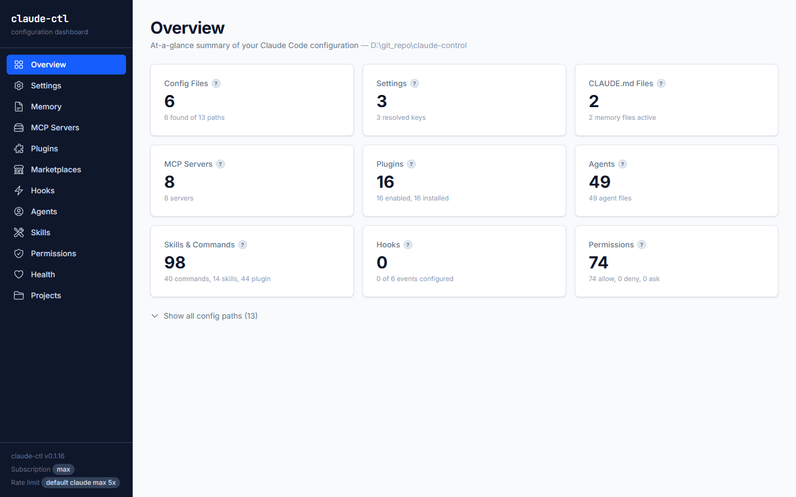
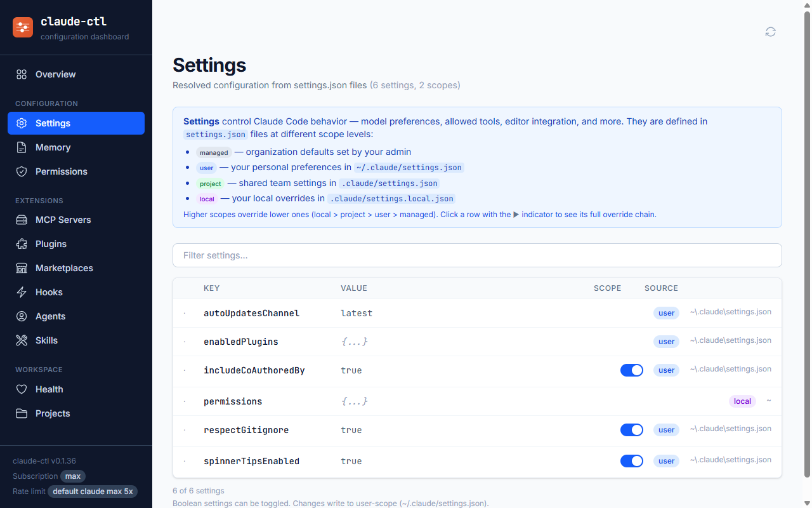
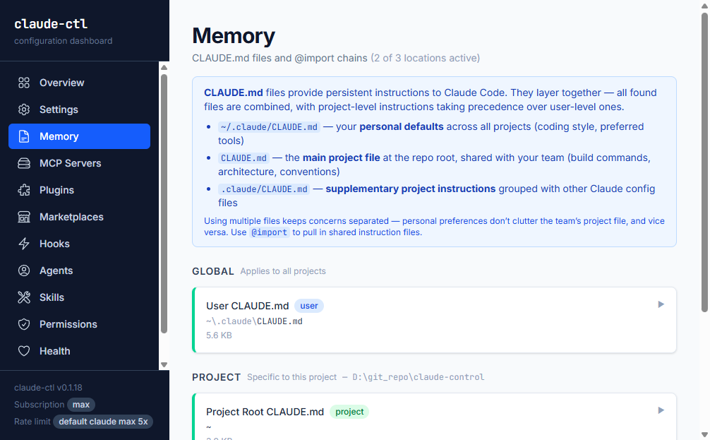
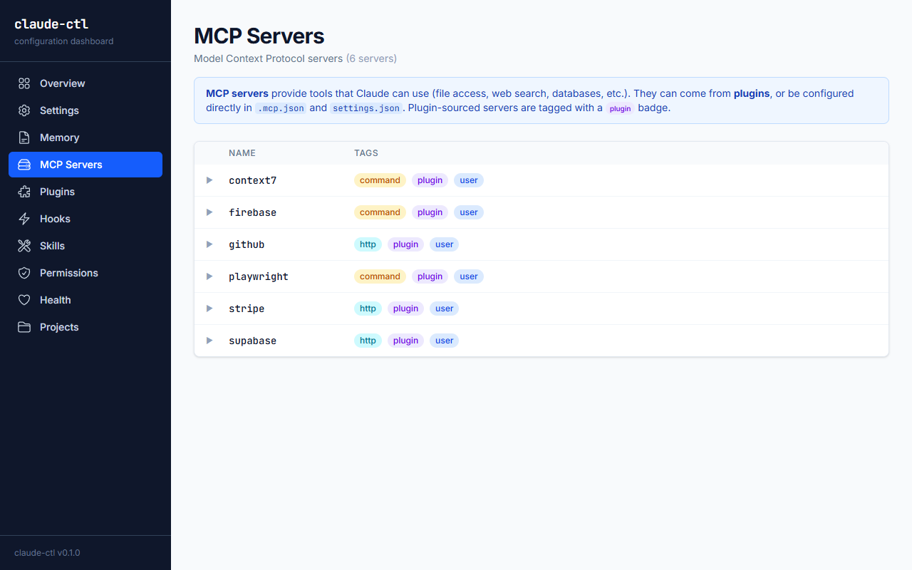
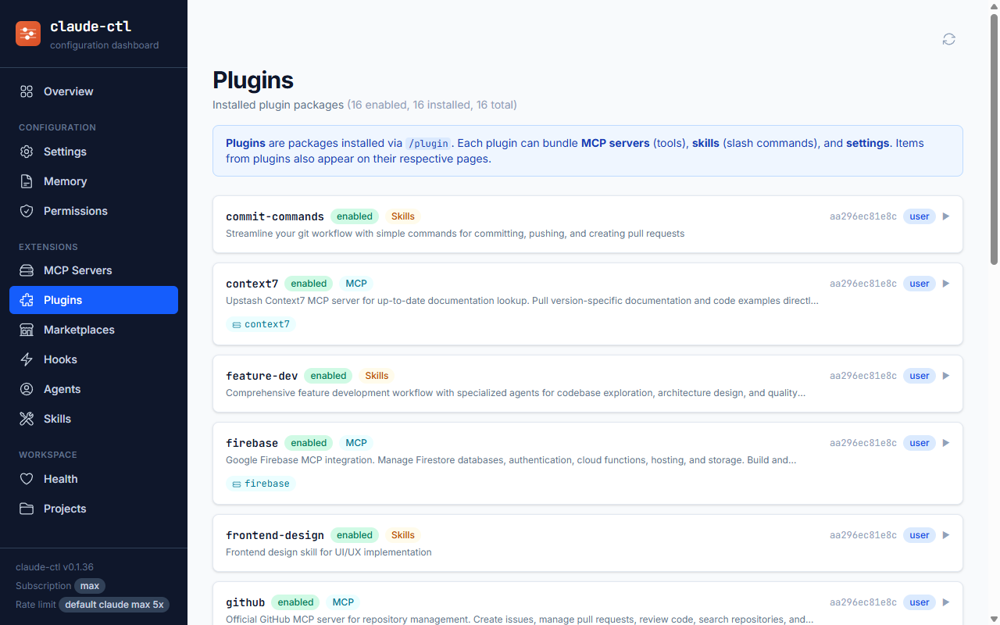
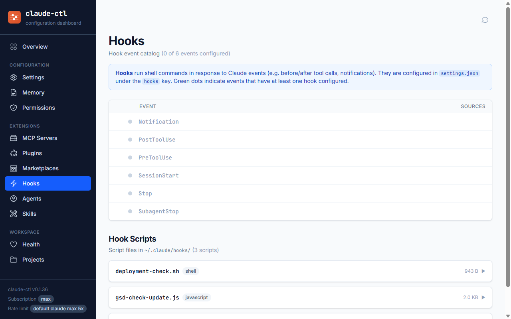
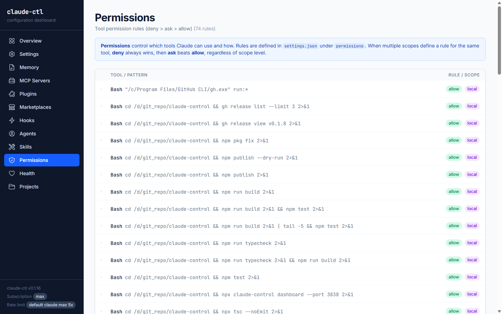
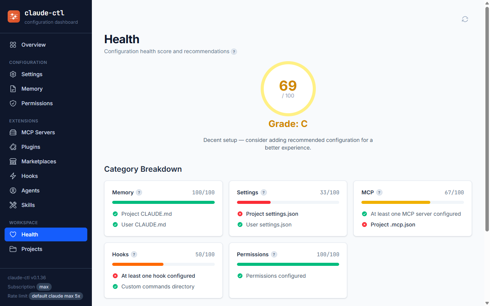
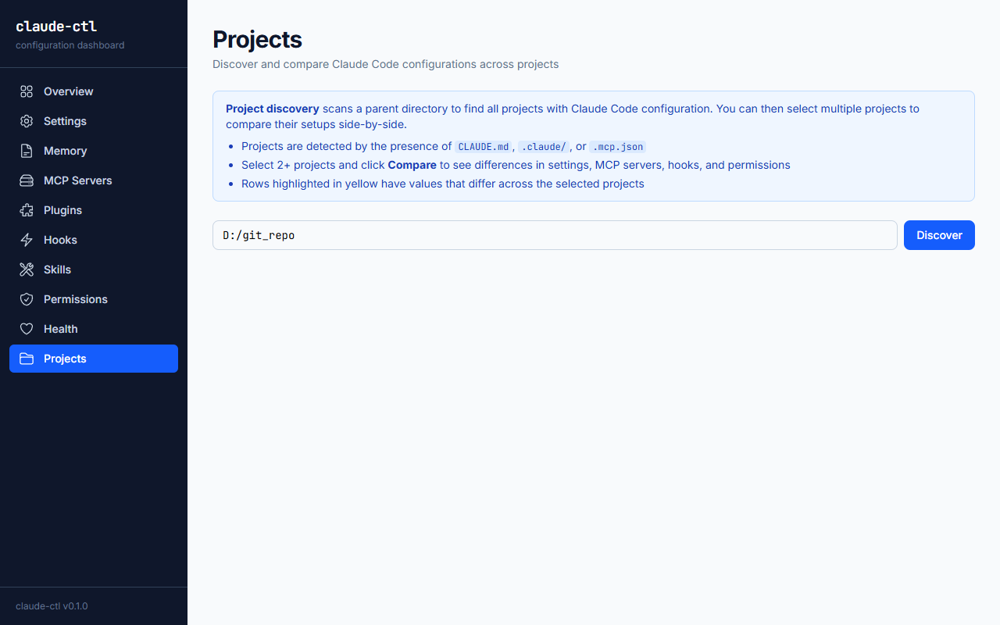

# claude-control

[](https://github.com/code-by-gunnar/claude-control/actions/workflows/ci.yml)
[](https://www.npmjs.com/package/claude-control)

CLI + web dashboard for inspecting Claude Code configuration across all scope levels.



## What It Does

`claude-control` scans Claude Code configuration files across all four scope levels (managed, user, project, local), resolves settings with full override chains, and displays the effective merged state of your setup. It shows MCP servers with automatic secret masking, extracts hooks and permissions, discovers CLAUDE.md memory files with import chains, provides configuration health scoring, and supports cross-project comparison. Everything is available as a terminal CLI or an interactive web dashboard.

## Install

```bash
npm install -g claude-control
```

Then use `claude-ctl` anywhere:

```bash
claude-ctl scan          # Discover all config files
claude-ctl status        # Summary of configured vs missing
claude-ctl dashboard     # Launch web dashboard
```

Or run without installing via `npx claude-control <command>`.

## CLI Commands

| Command | Description |
|---------|-------------|
| `claude-ctl scan` | Discover all config file locations and their existence status |
| `claude-ctl status` | Summary of configured vs missing files across scopes |
| `claude-ctl settings` | View resolved settings with scope and origin tracking |
| `claude-ctl memory` | List CLAUDE.md files and preview their content |
| `claude-ctl mcp` | List MCP servers across all scopes with secret masking |
| `claude-ctl hooks` | View configured hooks and the event catalog |
| `claude-ctl commands` | List custom slash commands and skills |
| `claude-ctl permissions` | Merged permissions audit with deny/ask/allow resolution |
| `claude-ctl health` | Configuration health score with category breakdown |
| `claude-ctl compare` | Cross-project configuration comparison |
| `claude-ctl dashboard` | Launch the interactive web dashboard |

## Common Flags

All commands support these flags:

- `--json` — Output results as machine-readable JSON instead of formatted tables
- `--help` — Show help for any command

Examples:

```bash
# JSON output for scripting
claude-ctl settings --json

# Pipe to jq for filtering
claude-ctl mcp --json | jq '.servers[] | select(.scope == "project")'

# Help for a specific command
claude-ctl health --help
```

## Web Dashboard

The web dashboard provides a visual interface for exploring your Claude Code configuration. Launch it with:

```bash
claude-ctl dashboard
```

This starts a local server and opens your browser at `http://localhost:3737`. Use `--port` to change the port:

```bash
claude-ctl dashboard --port 8080
```

The dashboard includes these pages:

### Settings
Resolved settings table with scope origin tracking and override indicators.



### Memory
CLAUDE.md files with content preview and import chain visualization.



### MCP Servers
All configured MCP servers with environment variables and secrets masked.



### Plugins
Installed plugin packages with their bundled MCP servers and skills.



### Hooks
Hook configurations and the full event catalog.



### Commands & Skills
Custom slash commands and plugin-provided skills.


### Permissions
Permission rules with merged deny/ask/allow resolution. Includes inline removal for non-managed entries.



### Health
Visual health score gauge with category breakdown and recommendations.



### Projects
Cross-project discovery and side-by-side configuration comparison.



## Config Scopes

Claude Code uses four configuration scope levels, listed from lowest to highest priority:

| Scope | Priority | Location | Purpose |
|-------|----------|----------|---------|
| **Managed** | 0 (lowest) | System-wide path | Enterprise/organization defaults |
| **User** | 1 | `~/.claude/` | Personal preferences |
| **Project** | 2 | `.claude/` in project root | Project-specific settings |
| **Local** | 3 (highest) | `.claude.local/` in project root | Local overrides (gitignored) |

**Settings merge:** Higher-priority scopes override lower ones. If both user and project define the same setting, the project value wins.

**Permissions merge:** Permissions use a different strategy where `deny` always wins regardless of scope, then `ask` beats `allow`. This ensures security rules cannot be overridden by lower-priority scopes.

## Requirements

- **Node.js 20** or later

## Development

```bash
# Install dependencies
npm install

# Build CLI + dashboard
npm run build

# Run tests
npm test

# Development mode (CLI watch)
npm run dev

# Development mode (dashboard)
npm run dev:dashboard
```

## License

[MIT](LICENSE)
